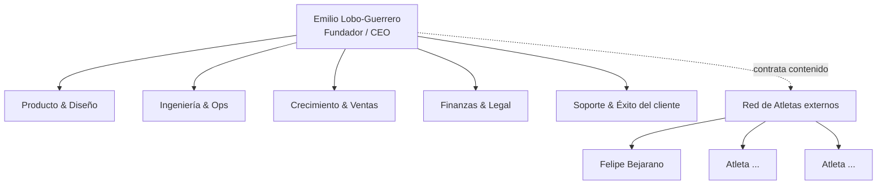

# Organigrama de Wake

> Wake opera como **founder-led con red de atletas externos**. No es un organigrama de headcount (una sola persona sostiene la operación); es un mapa **funcional**: qué áreas existen, quién las dueña hoy y quién colabora. Sirve para saber dónde cae cada decisión y qué podría delegarse primero al crecer.

Última actualización: 2026-07-11

---

## Vista general

```
                          ┌───────────────────────────┐
                          │   Emilio Lobo-Guerrero     │
                          │   Fundador / CEO           │
                          │   (dueño de todas las      │
                          │    áreas funcionales)      │
                          └────────────┬──────────────┘
                                       │
     ┌──────────────┬─────────────────┼─────────────────┬──────────────┐
     │              │                 │                 │              │
┌────┴─────┐  ┌─────┴──────┐   ┌──────┴──────┐   ┌──────┴─────┐  ┌─────┴──────┐
│ Producto │  │ Ingeniería │   │ Crecimiento │   │  Finanzas  │  │  Soporte   │
│ & Diseño │  │  & Ops     │   │  & Ventas   │   │  & Legal   │  │  & Éxito   │
└──────────┘  └────────────┘   └─────────────┘   └────────────┘  └────────────┘

                          ┌───────────────────────────┐
                          │   Red de Atletas (externos)│
                          │   Partners de contenido    │
                          │   — NO empleados —         │
                          └────────────┬──────────────┘
                                       │
                        ┌──────────────┼──────────────┐
                        │              │              │
                  ┌─────┴────┐   ┌─────┴────┐   ┌─────┴────┐
                  │  Felipe  │   │  Atleta  │   │  Atleta  │
                  │ Bejarano │   │    …     │   │    …     │
                  └──────────┘   └──────────┘   └──────────┘
```

Diagrama equivalente en Mermaid (por si el doc se abre en un visor que lo renderice):



---

## Núcleo (interno)

### Emilio Lobo-Guerrero — Fundador / CEO
Dueño único de la operación. Concentra hoy todas las áreas funcionales de abajo. Toda decisión de producto, plata y prioridad pasa por aquí.

| Área funcional | Qué cubre | Estado |
|---|---|---|
| **Producto & Diseño** | Visión de producto, roadmap, UX/UI, sistema de diseño (`docs/STANDARDS.md`, `docs/BRAND.md`), decisiones de las 3 apps (Landing, PWA, Creator Dashboard). | Emilio |
| **Ingeniería & Ops** | Desarrollo full-stack (monorepo), Cloud Functions/API, base de datos, deploys, observabilidad (Wake Ops), respuesta a incidentes, seguridad. | Emilio |
| **Crecimiento & Ventas** | Landing y buy pages, funnels (IG/ManyChat), pricing, analítica (PostHog), conversión, relación comercial con atletas. | Emilio |
| **Finanzas & Legal** | Cobros (MercadoPago + Polar), comisiones/payouts a atletas, refunds, impuestos, proveedores/facturación (Firebase, Resend, etc.). | Emilio |
| **Soporte & Éxito del cliente** | Atención vía WhatsApp/email (`soporte@wakelab.co`, `wa.me/573178751956`), remediación de compras (dobles cobros, cuentas varadas), retención. | Emilio |

> El valor de esta tabla es de priorización de delegación: cuando entre la primera contratación, la secuencia natural sugerida es **Soporte → Contenido/Ops de atletas → Crecimiento**, dejando Producto e Ingeniería como último core a soltar.

---

## Red de Atletas (externa)

Los atletas ("creators" en el código; **atletas** en la marca — ver `docs/BRAND.md`) **no son empleados**. Son partners de contenido con una relación comercial: publican programas en Wake y reciben un porcentaje de las ventas.

| Rol | Responsabilidad | Ejemplo |
|---|---|---|
| **Atleta / Partner de contenido** | Crea y mantiene sus programas de entrenamiento y nutrición, define precios (con Wake), atiende dudas técnicas de su método. | Felipe Bejarano (Método Bejarano, Código ABS) |
| **Wake (plataforma)** | Da la infraestructura: app, cobros, hosting, soporte de primer nivel, analítica, herramientas de creación (Creator Dashboard). | — |

**Interfaz atleta ↔ Wake:** el Creator Dashboard (`/creators`). El atleta opera de forma autónoma dentro de sus permisos (`role: creator`); Wake retiene admin de la plataforma.

---

## Roles del sistema vs. roles de la empresa

Ojo con no confundir los `role` de la base de datos con la estructura de la empresa:

| `users/{uid}.role` | Significado en el producto | Mapa a la empresa |
|---|---|---|
| `admin` | Control total de la plataforma | Emilio (fundador) |
| `creator` | Puede crear/publicar programas | Atleta externo (partner) |
| `user` | Consume programas | Cliente final |

---

## Notas

- Este organigrama es **funcional, no de personas**: refleja que una sola persona sostiene varias áreas. Actualízalo cuando entren contrataciones reales o cambie el modelo con atletas.
- Para el detalle de **cómo** se ejecuta cada área (flujos, responsables por paso, herramientas) ver `docs/PROCESOS.md`.
